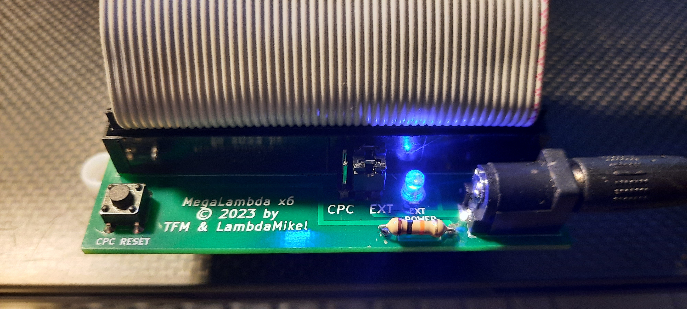
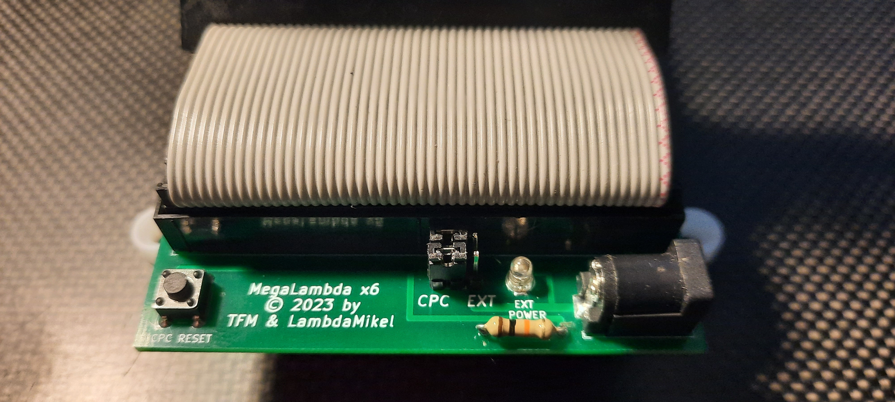
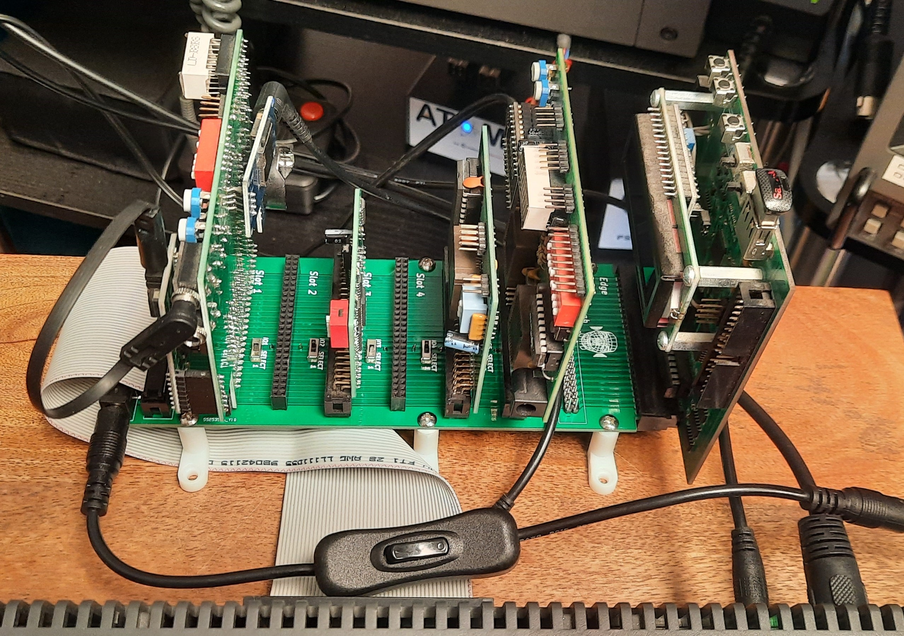
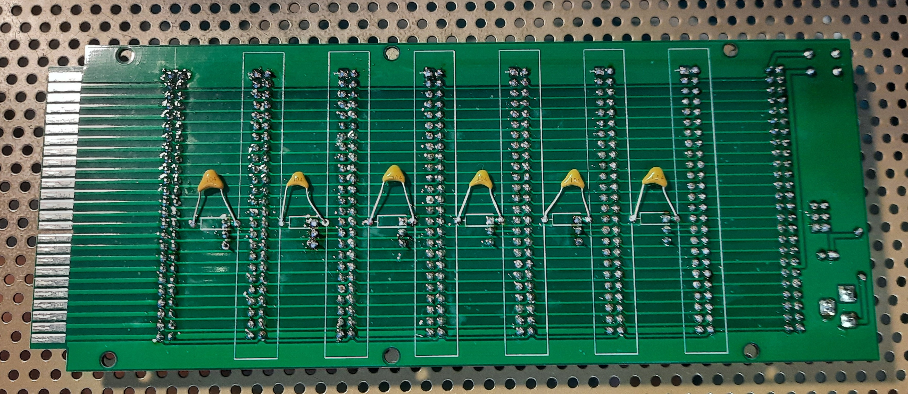
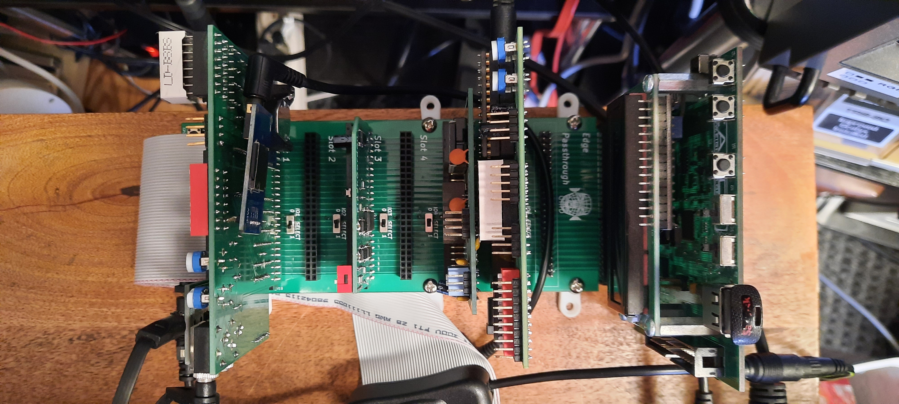
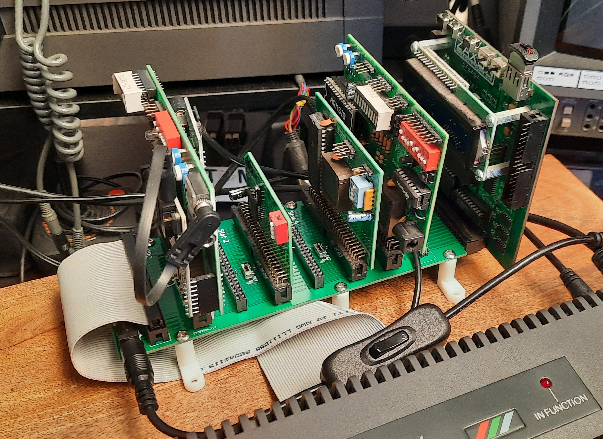
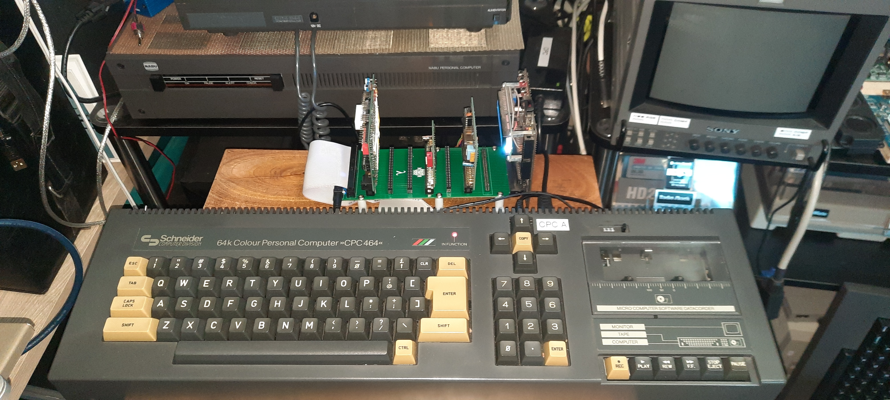
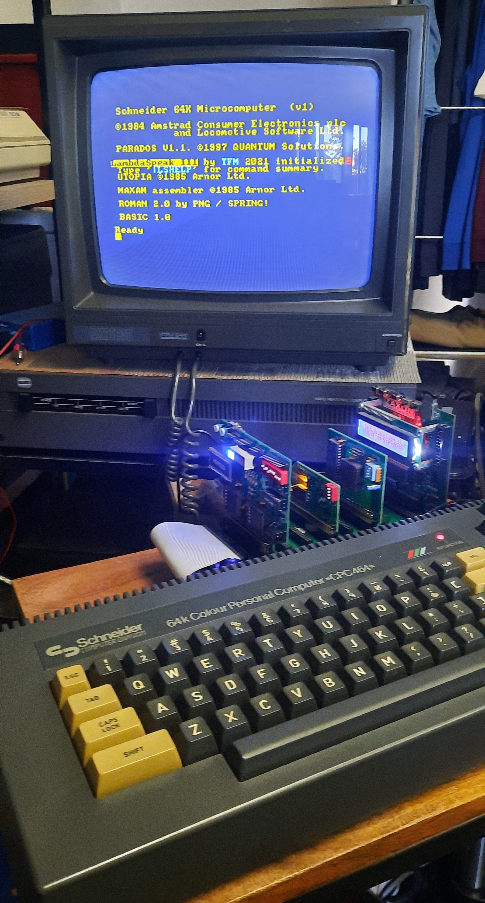
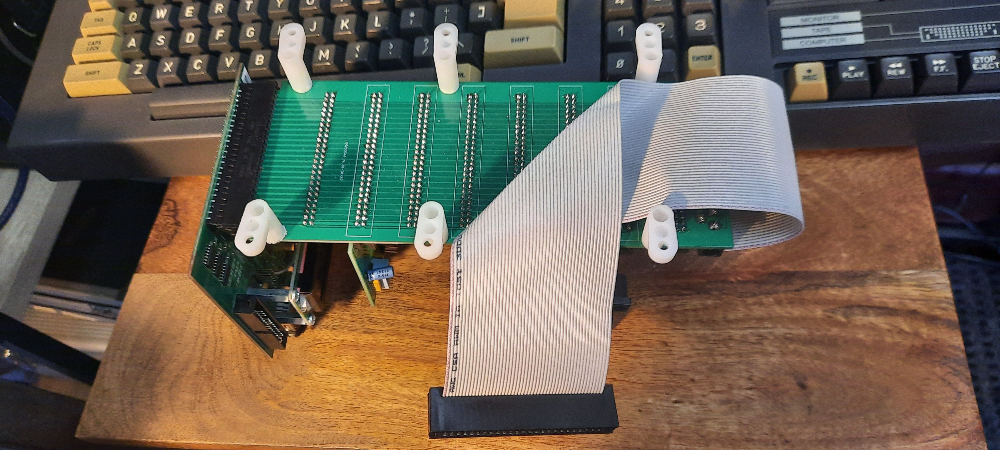

# MegaLambda-x6(++) 

**MegaLambda x6**, **MegaLambda x6++** - The Ultimate Backplane for the Amstrad CPC! 

## Purpose

Add **six** (!) MX4-compatible expansion card slots to your Amstrad / Schneider CPC, without loosing the edge connector - moreover, the **x6++ version** allows you to dis- and enable individual IO expansion cards one by one. 

Key features are:

1. Six standard MX4 expansion slots
2. Passthrough edge connector (like LambdaBoard I, II) 
3. Passthrough pin header connector (like MotherX4) 
4. Keyhole in edge connector for hardware that requires it (e.g., DKTronics Retro Speech Synthesizer, ...)
5. Wide signal traces for good signal conductivity
6. Extra wide traces for GND and VCC - unlike other backplane expanders for the CPC, MegaLambda is capable of powering the DDI-1 and DDI-3 without requiring an extra power supply 
7. Backplane powered from either the CPC or an external 5V power supply via standard barell jack (center polarity positive)
8. Double jumpers (for better conductivity) to select between CPC power and external power 
9. Power LED (only) if external power supply is used - polarity check!
10. The 5V / VCC line of the CPC expansion port is *physically disconnected* from the backplane if external power is used; only GND is shared with the CPC
11. CPC Reset button (yawn)

Additional features of the **x6++** version:

12. Each slot can be en-/disabled for IO Requests. Six little microswitches or jumpers can be used for this purpose. If disabled, the IOREQ line will be connected to 5V / VCC, herby disabling IO requests. If enabled, the IOREQ line will be connected to the CPC's IOREQ signal for normal operation. This is very useful in case cards share IO address ranges. Note that memory (RAM) expansions cannot be disabled like this. 

## Power Configuration via Double Jumper 

### External Power & Power LED - Double Jumper to the Right 

Note that the LED will light up only when the external PSU is
connected.  **Also, double check the polarity of the LED footprint on
the board - I might have gotten it wrong!** In any case, the PSU
polarity is *CENTER POSITIVE*, and 5V stabilized. A 10 USD 5V wall
wart from Amazon will do. Center positive is the default nowadays.
Usually, 1 to 1.5 Amps are perfect. I am using a 10kOhm resistor to
dim the LED so it's not too bright (can become annoying otherwise).

I recommend soldering in the LED as the last step. Hook up the power
supply and find the right orientation / polarity for the LED before
soldering it in (don't rely on the footprint on the PCB, double check
it).

  

### Powered by the CPC - Double Jumper to the Left

  

### x6++ Version - Individual IOREQ Switches 

Depending on the expansion cards you would like to disable, the board
either requires (e.g., 104 = 100 nF) capactitors, or just solid bridge
wires. It tested that both methods work with a large variety of
expansion cards (FlashGordon remake by PulkoMandy, XMem by ToTO,
LambdaSpeak, Ultimate MIDI Card, Speak&SID by myself). 

  

## YouTube Videos

### MegaLambda x6

[MegaLambda x6 Introduction](https://youtu.be/dHfIeu6RvlQ)

[MegaLambda x6 Long Cable Test](https://youtu.be/0CViRorZ7gk)

[MegaLambda x6 CPC 6128 Test](https://youtu.be/cwNZN3z0Z7E)

### MegaLambda x6++ 

[The Ultimate CPC Expansion Backplane Got Upgraded - Meet the MegaLambda x6++!](https://youtu.be/FK6HFwhmiFs)

[MegaLambda x6++ - Long Cable with CPC 6128 Test](https://youtu.be/EiqiXnbGWaY)

## Creators 

Idea by [TFM](http://futureos.cpc-live.com/). Design and realization by [LambdaMikel](https://github.com/lambdamikel), June 2023. 

## Application Examples MegaLambda x6

  
  
  
  
  

## Application Examples MegaLambda x6++

  
  
  

## Application Examples with Long Cable 

  

### Cable Routing

  

## Gerbers 

The **MegaLambda x6** Gerbers are [here](gerbers/mega-lambda-x6.zip).

The **MegaLambda x6++** Gerbers are [here](gerbers/mega-lambda-x6++.zip).

