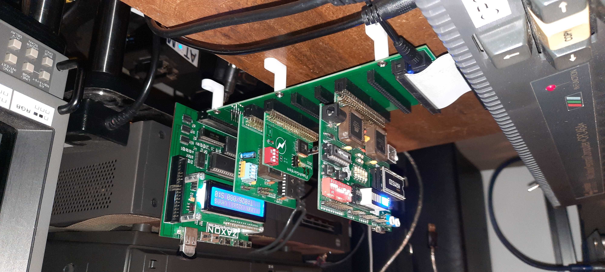
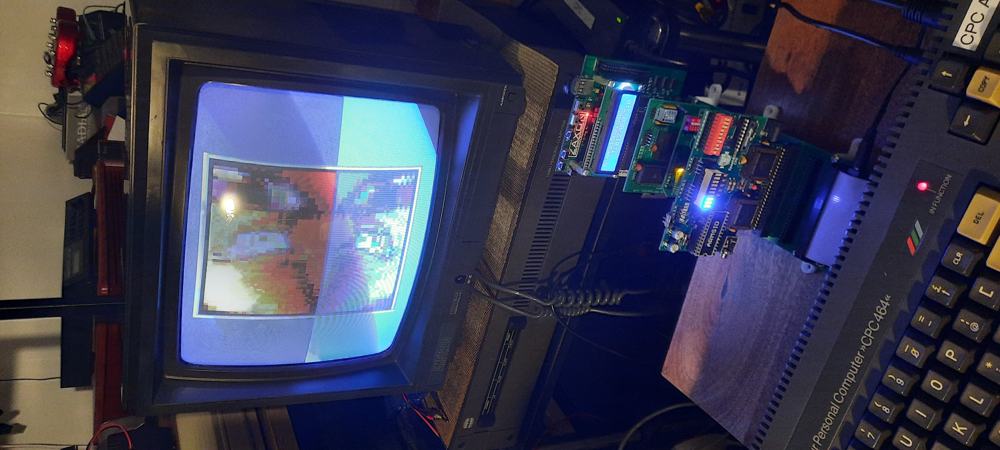
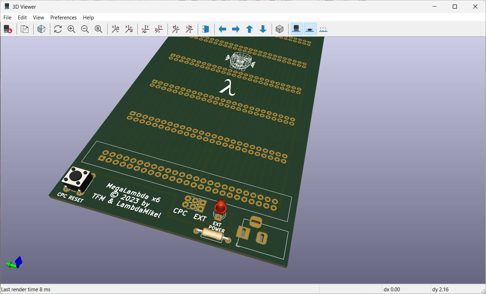
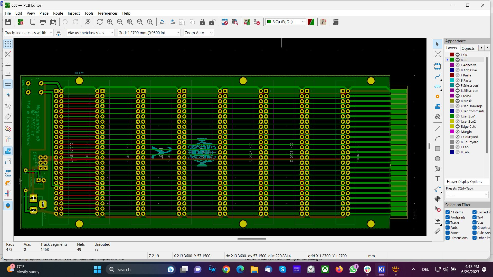
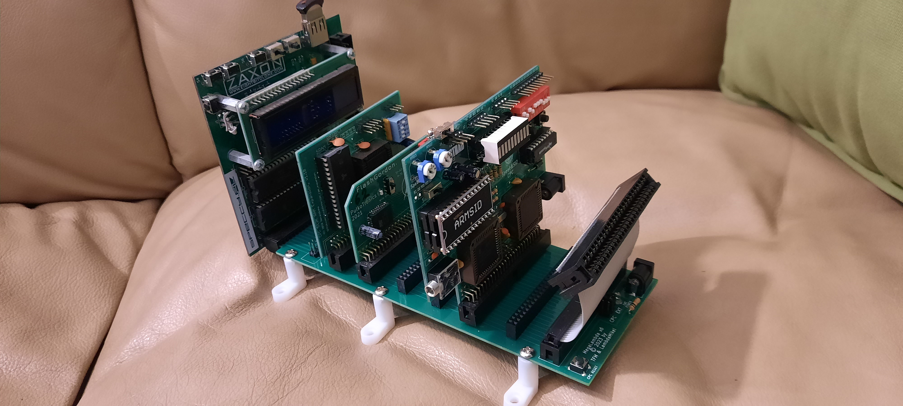
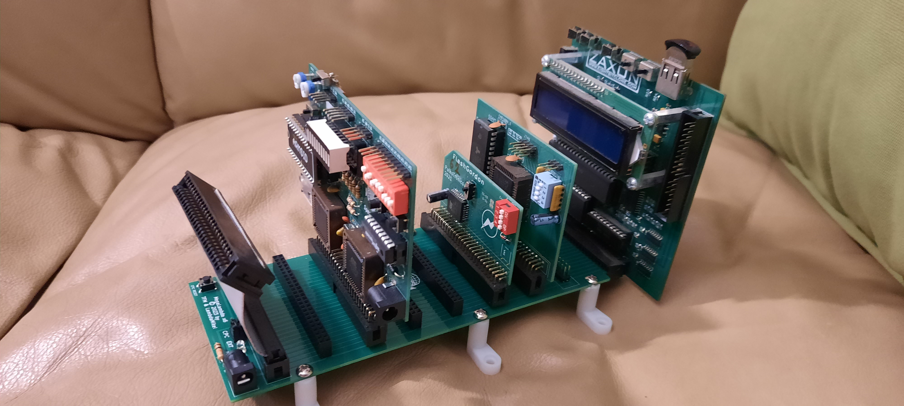

# MegaLambda-x6

*MegaLambda x6* - The Ultimate Backplane for the Amstrad CPC! 

## Purpose

Add *six* (!) MX4-compatible expansion card slots to your Amstrad / Schneider CPC, without loosing the edge connector. 

Key features are:

1. Six standard MX4 expansion slots
2. Passthrough edge connector (like LambdaBoard I, II) 
3. Passthrough pin header connector (like MotherX4) 
5. Keyhole in edge connector for hardware that requires it (e.g., DKTronics Retro Speech Synthesizer, ...)
6. Wide signal traces for good signal conductivity
7. Extra wide traces for GND and VCC - unlike other backplane expanders for the CPC, MegaLambda is capable of powering the DDI-1 and DDI-3 without requiring an extra power supply 
8. Backplane powered from either the CPC or an external 5V power supply via standard barell jack (center polarity positive)
9. Double jumpers (for better conductivity) to select between CPC power and external power 
10. Power LED (only) if external power supply is used - polarity check!
11. The 5V / VCC line of the CPC expansion port is *physically disconnected* from the backplane if external power is used; only GND is shared with the CPC

## Creators 

Idea by [http://futureos.cpc-live.com/](TFM). Design and realization by [https://github.com/lambdamikel](LambdaMikel), June 2023. 

## Application Examples 

  
  
  
  
  
  

## Gerbers 

The Gerbers are [here](gerbers/mega-lambda-3.zip). 
